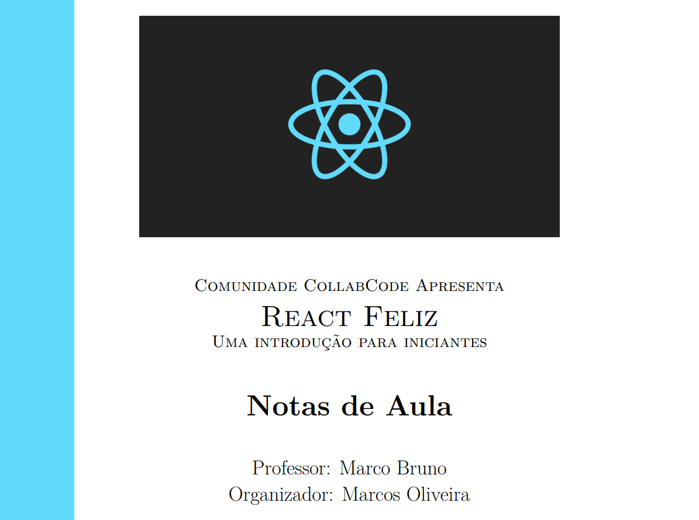

## Sumário

- [Introdução](#introdução)
- [O que você vai aprender](#o-que-voce-vai-aprender)
- [Notas de Aula](#notas-de-aula)
- [Contribua](#como-contribuir)

## Introdução

React Feliz é um curso desenvolvido pelo brabíssimo [**Marco Bruno**](https://twitter.com/marcobrunodev) para iniciantes da tecnologia React. As aulas estão em andamento e são ministradas todas as segundas-feiras no servidor da comunidade [**_CollabCode_**](https://discordapp.com/invite/FP5UaAG) e em seu canal de live na [**Twitch**](https://www.twitch.tv/marcobrunodev).

Este repositório tem o objetivo de disponibilizar anotações, comentários e complementos realizados durante o curso, visando uma maior fixação do conteúdo. Além disso, essas notas podem servir como material de consulta no futuro, tanto pelo autor quanto por outras pessoas desenvolvedoras.

Convido a todas as pessoas desenvolvedoras da comunidade (ou não) a contribuírem. A ideia é fazer um repositório didático e completo sobre os diversos tópicos abordados durante o curso.

## O que você vai aprender?

O projeto consiste em desenvolver um aplicativo mobile de _chat_ (mensageiro) instantâneo utilizando apenas React, mas passando uma visão ampla do mercado de trabalho atual utilizando **_Squads_** (um dos processos de metodologias ágeis) e a arquitetura **_Micro Front-End_**. Abaixo seguem alguns _previews_ das telas e as informações completas podem ser consultadas na [**Aula 1**](#notas-de-aula).

Tela de cadastro, login e _esqueci minha senha_:

Tela inicial (conversas, conta e busca):

## Notas de Aula

- [Aula 1 ](./notas/aula-1/aula1.md)
- [Aula 2](./notas/aula-2/aula2.md)

## Como contribuir

Gostou da iniciativa? Você pode ajudá-la contribuindo com revisões, correções e adições das notas! Qualquer contribuição que vise melhorar o material, tornando o mais acessível e completo, será bem-vinda.

Entenda a [estrutura das notas](contribua.md) e contribua agora mesmo!
