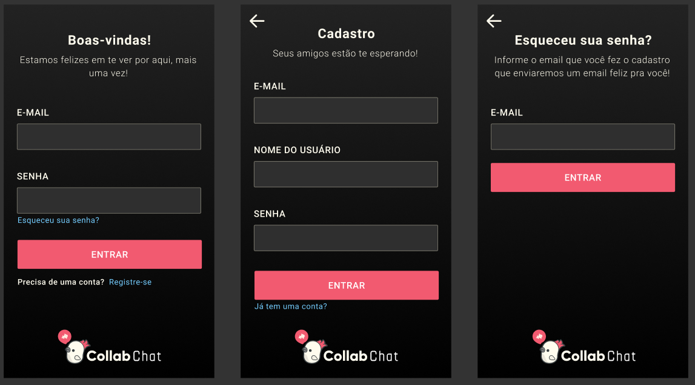

# Aula 1 - 07/02/2022

**_Status:_** Em desenvolvimento

**_Última atualização:_** 21/02/2022

**_Resumo:_** Na primeira aula do curso foi apresentado o projeto, seu objetivo e a dinâmica das aulas. Além disso, foi explicado como preparar o ambiente de desenvolvimento.

# Tópicos Relevantes Ainda Não Aprofundados

- Durante todo o projeto será utilizada a concepção de _mobile first_ (desenvolver pensando primeiramente em _smartphones_), uma vez que a maior parte do público utiliza os celulares para acessarem as aplicações do dia a dia.

- **_Squads_** são equipes responsáveis por determinada parte do _software_. Geralmente está presente como parte de uma metodologia ágil mais ampla. Um dos principais benefícios dos _squads_ é dar autonomia para a equipe de desenvolvimento.

# O Projeto

## Layout

O _design_ e _layout_ do projeto podem ser encontrados através do _download_ e importação do arquivo `CollabChat.fig` disponível neste diretório ou visualizados diretamente na plataforma [Figma](https://www.figma.com/file/MLMdCPFyCOjH1K2RCx11ge/CollabChat).

Design System

Tela de cadastro e _login_

Tela inicial e chat

Tela de editar conta e busca

## Estrutura do Curso - O que será visto?

O objetivo do Marco é abordar todos os tópicos abaixo:

# Conceitos abordados

## Micro frontend

**_Micro Front-End [^obs-microfront]_** é o conceito de separar o _front-end_ da aplicação em várias camadas menores, cada uma sendo responsável por um módulo específico da aplicação. Essa abordagem é relevante principalmente em grandes aplicações por permitir maior flexibilidade e customização de um produto, sem a necessidade de refazer o código completamente e sem o risco de afetar todo o sistema.

### Material complementar

|                                                               Artigos                                                                |                                                  Vídeos                                                   |
| :----------------------------------------------------------------------------------------------------------------------------------: | :-------------------------------------------------------------------------------------------------------: |
|                                    [Micro Frontends](https://micro-frontends.org/) [Documentação]                                    |            [Micro-Frontends Course - Beginner to Expert](https://youtu.be/lKKsjpH09dU) [Curso]            |
| [Micro Front-End - Microserviços no seu navegador](https://www.treinaweb.com.br/blog/micro-front-end-microservicos-no-seu-navegador) |      [Implementando micro front-end com Single SPA e React](https://youtu.be/68LaXOWwxZI) [Tutorial]      |
|                                                                                                                                      | [Do Monolito aos Microfrontends: Escalando a Arquitetura na Web](https://youtu.be/QPqPeEdsa_w) [Palestra] |
|                                                                                                                                      |                  [O que é micro front-end?](https://youtu.be/dg4qsABXhE4) [Explicativo]                   |
|                                                                                                                                      |          [O que são Microsserviços? (Microservices)](https://youtu.be/jSnLOoGjQ80) [Explicativo]          |

### Breves considerações

| Pontos negativos | Pontos positivos |
| :--------------: | :--------------: |
|   Complexidade   |   Customização   |
|                  |  Flexibilidade   |
|                  | Descentralização |

# Ferramentas comentadas

## Ferramentas de Build (e Bundle)

Uma ferramenta de build (conhecidas também como bundle) é, em sua essência, um sistema que permite automatizar todas as tarefas rotineiras de um projeto de uma forma organizada e padronizada, economizando o tempo de realizar dezenas de configurações manuais.

Nesse projeto, foi utilizada `Vite`. De acordo com o [State of JS 2021](https://2021.stateofjs.com/en-US/libraries/build-tools), as ferramentas de build mais utilizadas atualmente são:

As mais satisfatórias em 2021 foram:

E as que mais geraram interesse nas pessoas desenvolvedoras foram:

|                                                                        Artigos                                                                         | Vídeos |
| :----------------------------------------------------------------------------------------------------------------------------------------------------: | :----: |
| [Ecossistema JavaScript — Parte 05: Bundlers (Builders)](https://blog.codecasts.com.br/ecossistema-javascript-parte-05-bundlers-builders-6809b17ddcf8) |        |

# Perguntas realizadas

## O que é PWA (_Progressive Web App_)?

Uma Aplicação Web Progressiva (PWA) é um conjunto de processos que visa produzir uma solução híbrida entre sites e aplicativos mobile. Em outras palavras, é uma forma de aproveitar o código web e transformá-lo em um aplicativo, mantendo as vantagens das duas plataformas.

## O que seria bundler?

É basicamente a mesma coisa que as ferramentas de _build_, a diferença é que uma _bundler_ tende a ser mais completa, uma vez que não apenas compila, como também visa otimizar, padronizar e facilitar processos durante o desenvolvimento.

[^obs-microfront]: Uma analogia, para quem conhece back-end, seria pensar em microsserviços. Além disso, o modelo tradicional, que não faz essa separação de camadas, é chamado de monolítico.
